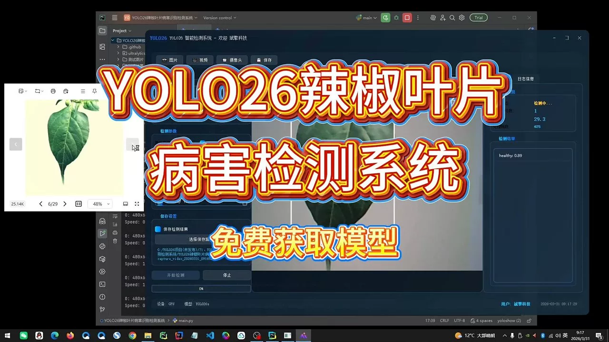
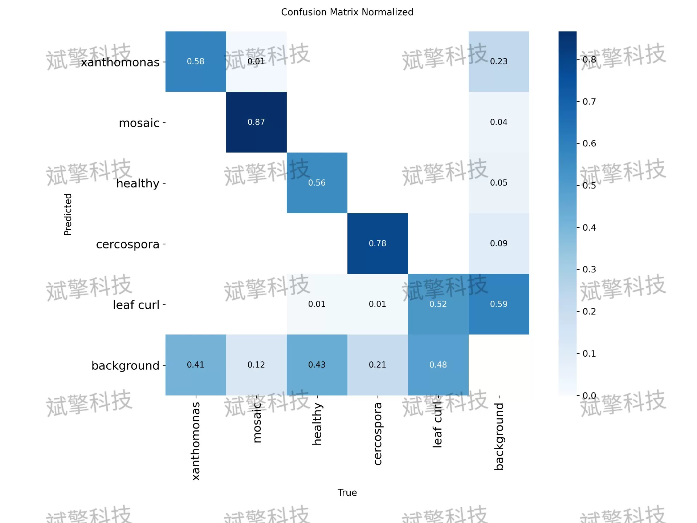
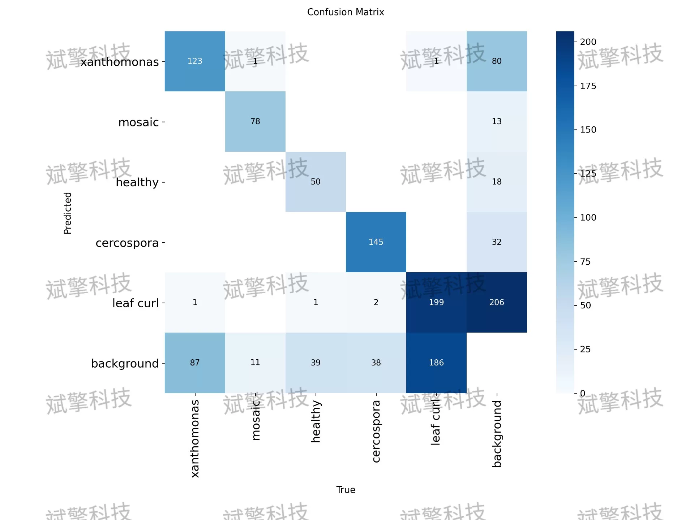
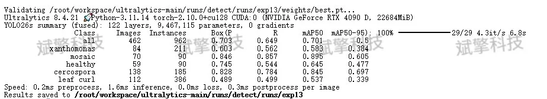
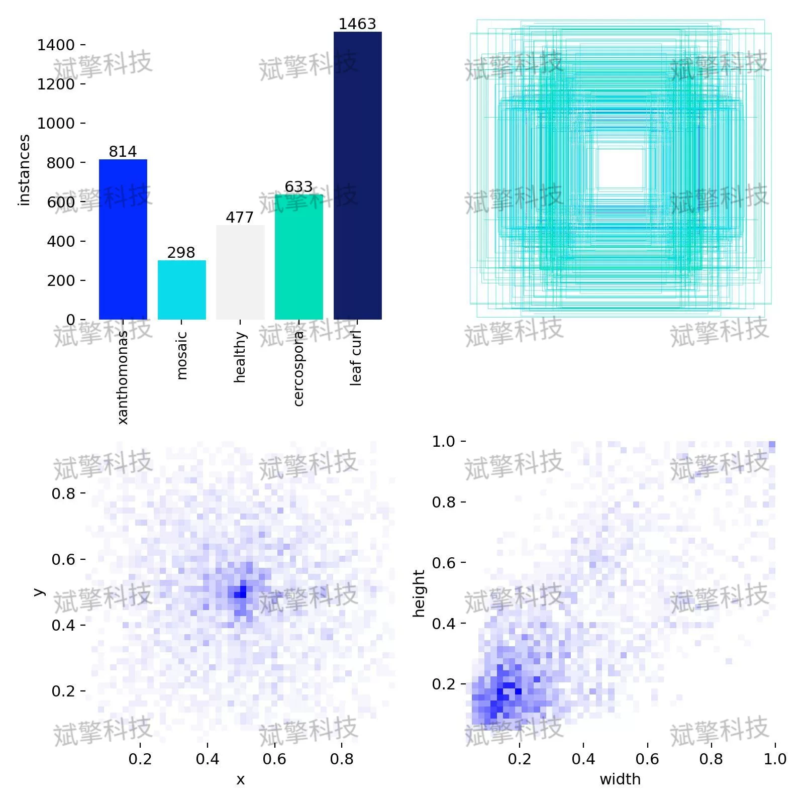
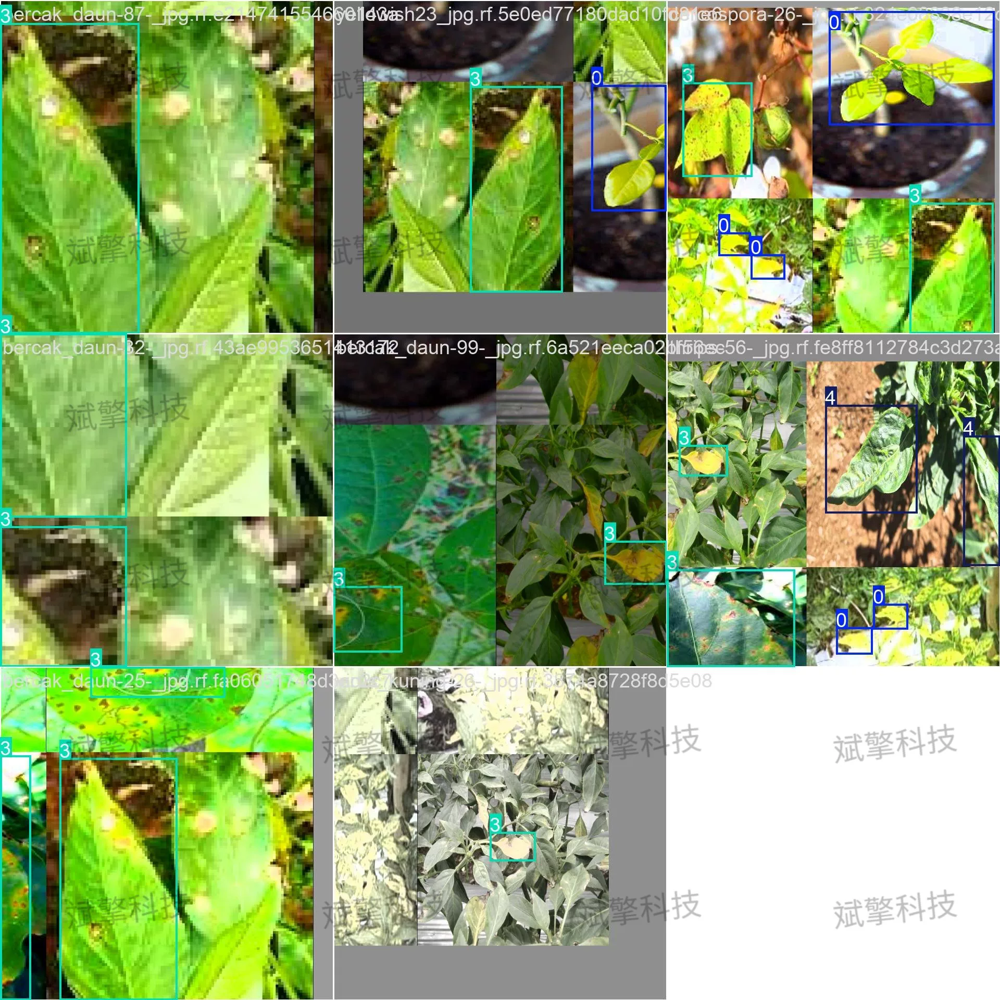
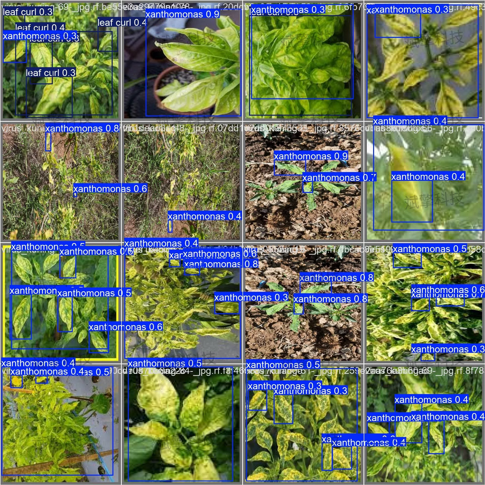
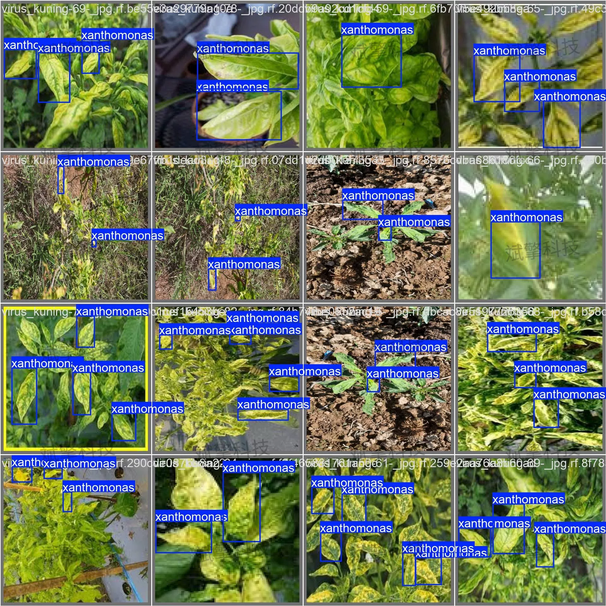
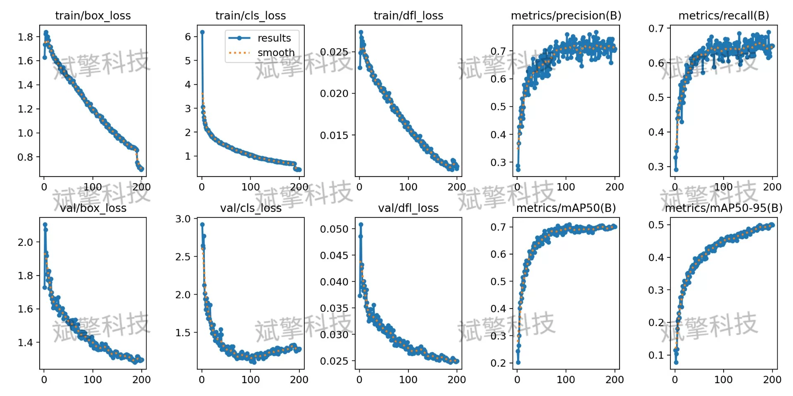

# YOLO26 Pepper Leaf Disease Identification and Detection System

## Body

YOLO26+ is a pepper leaf disease recognition detection system that uses YOLO26 to identify diseases such as Botrytis blight and Curled Top in peppers. This system improves the yield of pepper crops by accurately detecting these diseases from datasets.

Chilli, as one of the important economic crops in China, is easily attacked by various diseases during its growth process, which seriously affect its yield and quality. In response to the problems of low efficiency and subjectivity in traditional manual disease identification, this paper constructs a Chili leaf disease identification detection system based on YOLO26 object detection algorithm. This system can automatically identify the types of Chili leaf diseases in images, including five categories: bacterial leaf spot (xanthomonas), mosaic, healthy leaves, cercospora, and leaf curl.

The dataset consists of a total of 2,258 images. Following the standard division for target detection tasks, the dataset is divided into training set and validation set:
Training set: 1,796 images, accounting for 79.5% of the total data volume, used for model training and parameter optimization.
Validation set: 462 images, accounting for 20.5% of the total data volume, used for model performance evaluation and hyperparameter tuning.

Free remote installation appointments. Unsuccessful, full refund.
Purchase includes the following resources (auto-unlocked by Baidu Pan)
YOLO recognition detection project complete source code
YOLO format datasets
Training code + UI interface code
Trained model + results images
Software installation package
Add WeChat to make a remote installation appointment (shown automatically after purchase) —— Unsuccessful, full refund

⚙️ Core Function Modules
Detection Capabilities
    Image Detection: Upon upload, returns detection boxes + category information.
    Video Detection: Supports video files, analyzes frames accurately in real-time.
    Camera Real-Time Detection: Attaches USB cameras to achieve dynamic monitoring.

️ Interaction and Control
    Target Filtering: Choose one or more categories for detection freely.
    Parameter Real-Time Adjustment: Adjustable confidence threshold & IoU threshold, flexibly control accuracy.
    Result Save: One-click save of image/video/camera detection results.

System and Data
    User Login and Registration: Supports password strength checking + encrypted storage.
    Logging: Auto-records operation and error information (with timestamp).

## Images

## Payment

Here is a pay link on Stripe ( https://buy.stripe.com/3cs8yP7sY87d0vu9AB ). Please contact me lonlonago@foxmail.com after funding $89, and I will send you a complete data files , thank you!

